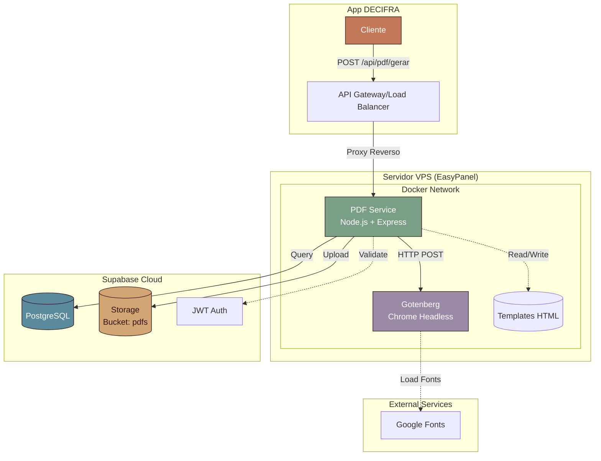
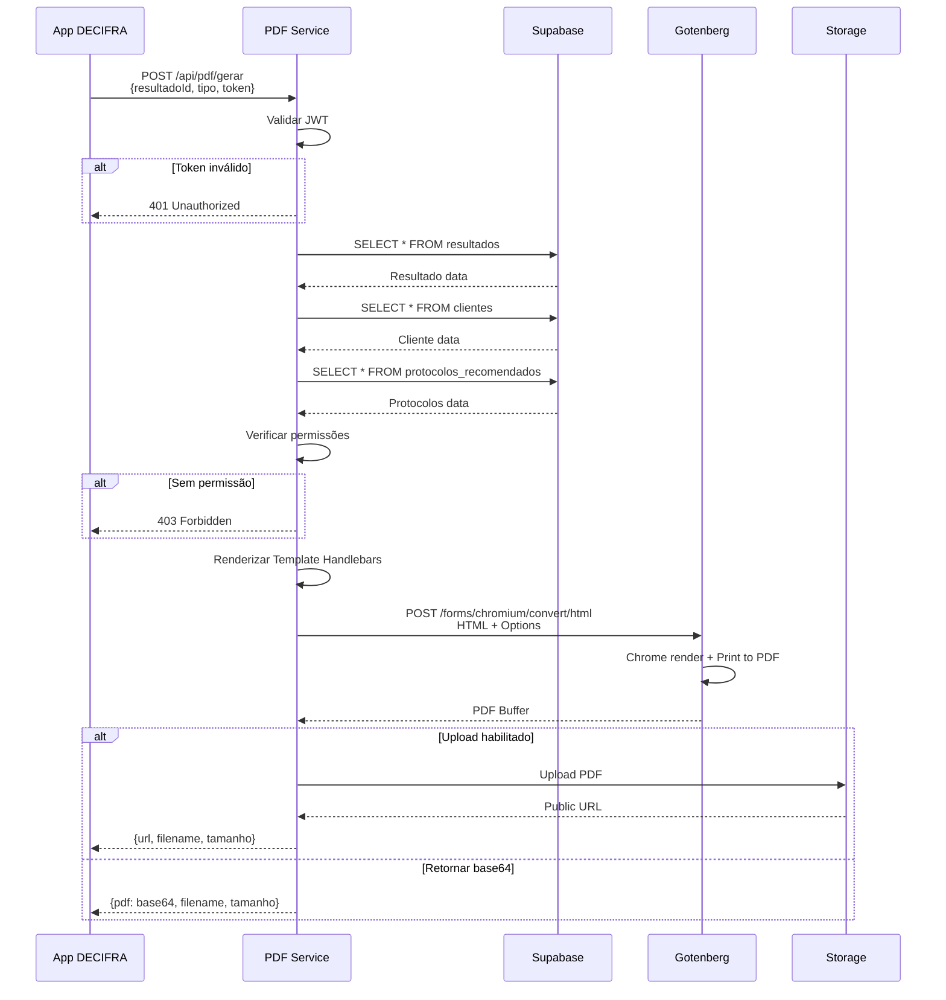
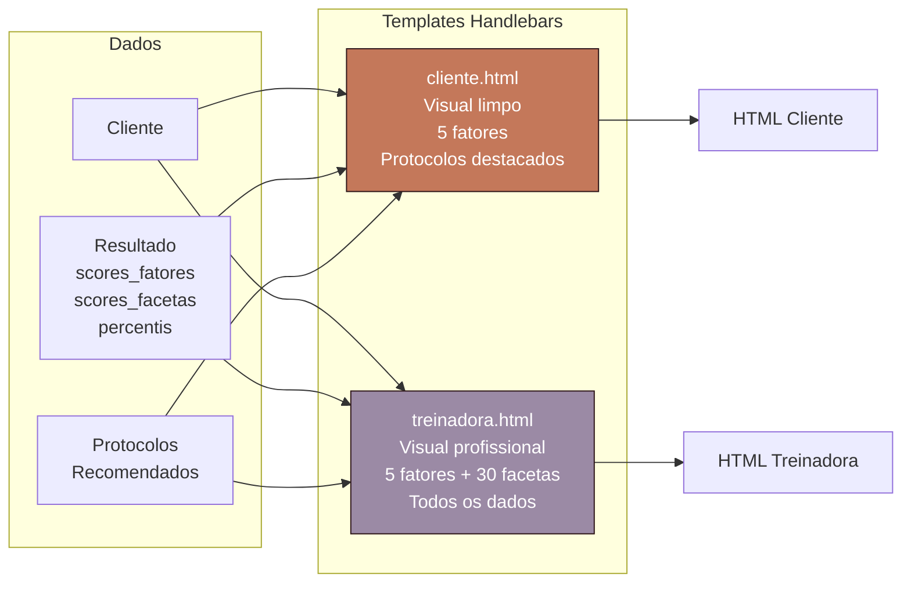
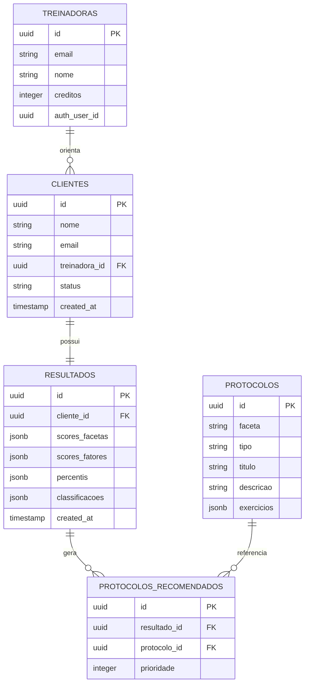
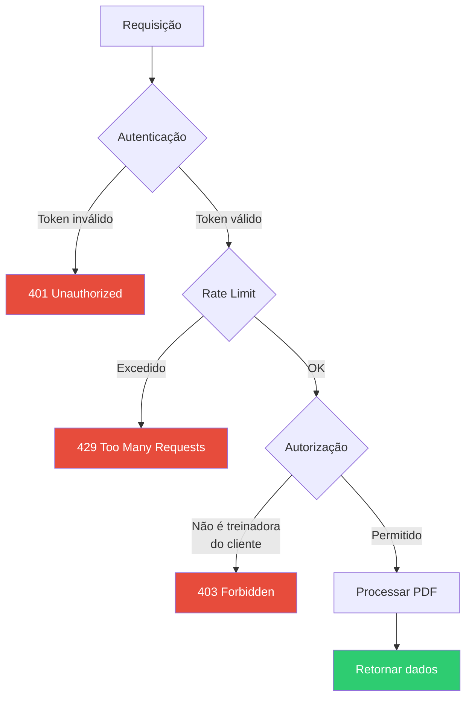
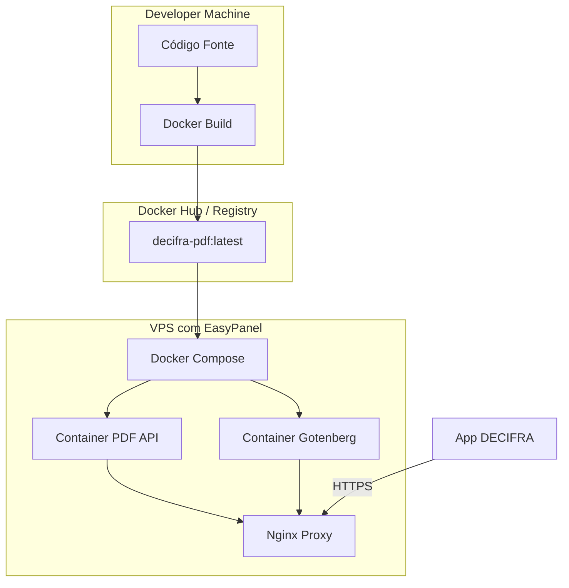
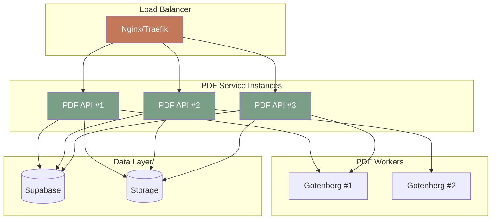

# 🏗️ Arquitetura do Serviço PDF

## Diagrama de Componentes



## Fluxo de Geração de PDF



## Estrutura de Templates



## Modelo de Dados



## Segurança



## Deployment



## Escalabilidade



> **Nota:** Para escalar, basta aumentar o número de réplicas no Docker Compose:
> ```yaml
> deploy:
>   replicas: 3
> ```
